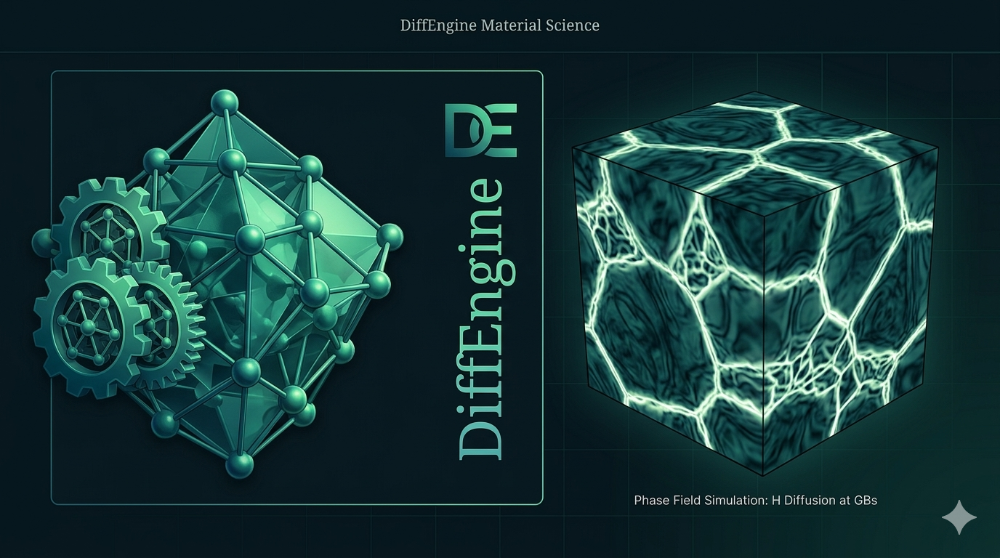

<p align="center">
  
</p>

<h1 align="center">DiffEngine</h1>


<p align="center">
  A workspace of Python tools for computing diffusion and transport
  coefficients in crystalline materials.
</p>

---

## About

DiffEngine is a collection of Python projects for modeling atomic-scale
transport in crystals — built around jump-network construction, rate-matrix
assembly, and analytical/symbolic evaluation of diffusion coefficients from
transport theory. The underlying methods are general to any crystalline
diffusion problem describable by a site/jump network.

This repository is organized as a [uv workspace](https://docs.astral.sh/uv/concepts/projects/workspaces/):
each subdirectory is an independent Python project with its own
`pyproject.toml`, sharing a single lockfile so the projects can depend on
one another and be developed together.

## Projects

| Project | Description |
|---|---|
| [`symdct`](symdct/) | Symbolic and numerical computation of diffusion coefficients from crystal transport matrices — jump-network construction, matrix assembly, block-Schur elimination, and harmonic (Fourier) determinant evaluation. |

*(Additional workspace members will be listed here as they're added.)*

## Getting started

This repo uses [uv](https://docs.astral.sh/uv/) to manage the workspace and
its dependencies.

```bash
# clone the repo
git clone https://github.com/<your-org-or-user>/DiffEngine.git
cd DiffEngine

# install all workspace members and dependencies
uv sync

# run a specific project's tests, e.g.
uv run pytest symdct/tests
```

Each project has its own README with details on installation extras,
usage, and examples — see the table above.

## Repository structure

```
DiffEngine/
├── pyproject.toml     # uv workspace root
├── README.md           # this file
└── symdct/             # first workspace member (see symdct/README.md)
    ├── pyproject.toml
    ├── src/symdct/
    ├── tests/
    ├── docs/
    ├── examples/
    ├── tutorials/
    └── paper/
```

## Citing

If you use tools from this repository in published work, please see the
`CITATION.cff` file within the relevant project subdirectory (e.g.
[`symdct/CITATION.cff`](symdct/CITATION.cff)) for citation information.

## License

TODO: add license.

## Contributing

TODO: add contribution guidelines, or link to per-project `CONTRIBUTING.md`
files if they differ across workspace members.
