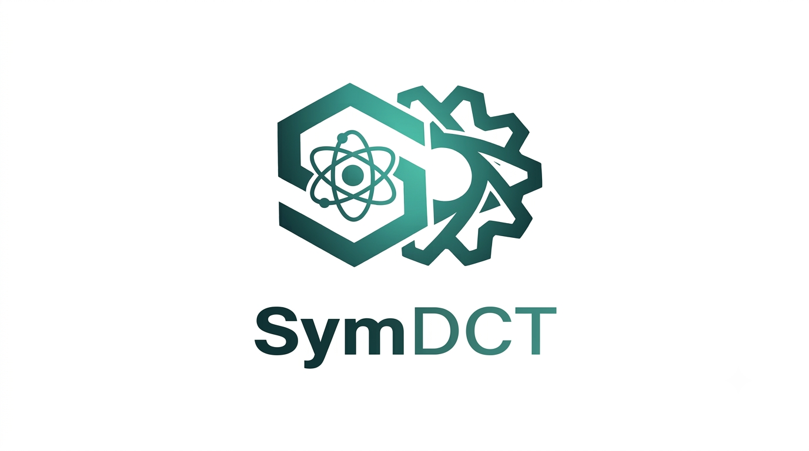

  

<h1 align="center">SymDCT</h1>

  A symbolic toolkit for analytical diffusion coefficient tensor calculations
  in crystals from atomic-scale kinetic data.

---
# What is SymDCT?
SymDCT is
- graph-based
- symmetry-based
- exact
- designed for complex crystals
- suitable for first-principles or ML interaction potential based diffusion calculations

# Main Features

# Scientific Background

# Current Status
> **Status:** Pre-release / active development. First public version (v0.1.0)
> targeted for **September 1, 2026**. See [ROADMAP.md](symdct/ROADMAP.md) for details.

# Roadmap

# Installation

# Examples

# Documentation

# Citation

# Contact
Email: pavel.vladimirov@kit.edu; pavel.v.vladimirov1962@gmail.com
